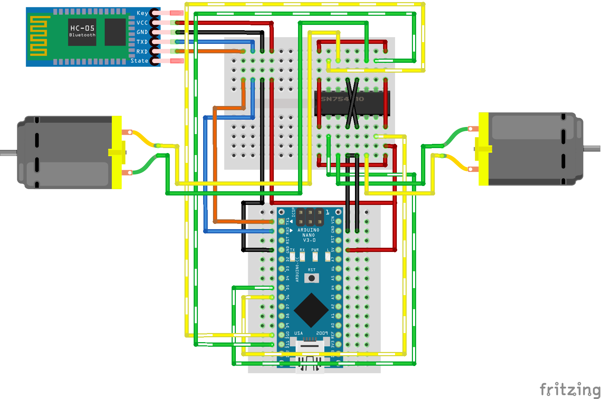

##Project 1: AcidBot beta
Simple bluetooth / serial controlled car with a DVD as chassi and an Arduino UNO.

#### Used:

* [A DVD as platform/chassi](http://acidhub.click/imghp/Arduino/DVD.jpg) :dvd:
* [Arduino Nano with extension board](http://acidhub.click/imghp/Arduino/Nano_with_board.jpg)
* [2-way DC motor drive](http://acidhub.click/imghp/Arduino/Motor_drive.jpg)
* [2 DC motors with wheels](http://acidhub.click/imghp/Arduino/motor_wheel.jpg)
* [Mini breadboard](http://acidhub.click/imghp/Arduino/Breadboard_mini.jpg)
* [Bluetooth adapter](http://acidhub.click/imghp/Arduino/bluetooth.jpg)
* [Some few connections](http://acidhub.click/imghp/Arduino/complex-wiring.jpg)
* Glue :trollface:

#### Wiring:

#### Final result:

