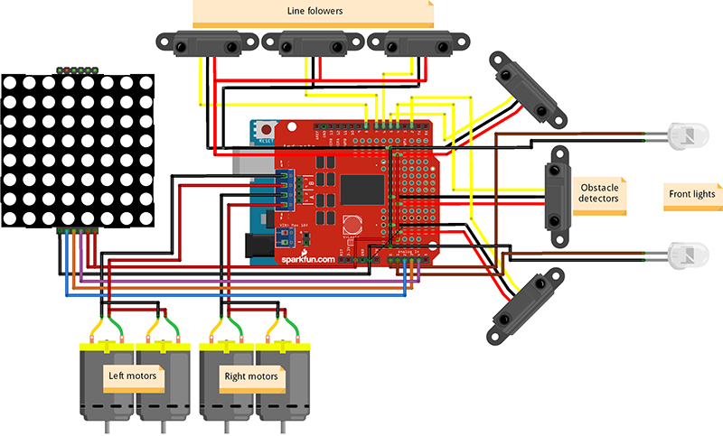
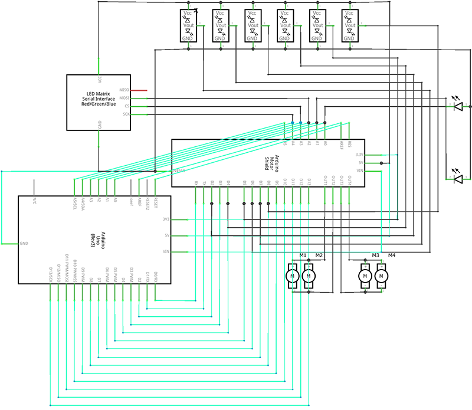

##Project 2: Acidbot gamma (phases Bluetooth, Line and Obstacle)

Bluetooth or Serial controlled car.

* Complete bluetooth integration.
* Motor control (forward, backward, left, right)
* Lights ON/OFF (front)
* Autonomous mode (Obstacle avoidance with IR sensors)

#### Used
[KEYESTUDIO Car Kit (KS0159):](http://www.keyestudio.cc/nd.jsp?id=125&_sc=2)

1. N20 metal gear motor * 4
2. High quality tire * 4
3. Motor holder * 4
4. Car chassis * 2
5. L298P motor driver shield * 1
6. ARDUINO UNO328 board * 1  
7. ARDUINO sensor shield * 1
8. Infrared obstacle avoidance module * 3
9. Line tracking module * 3
10. HC-06 Bluetooth module * 1
11. 14500 battery pack * 1
12. 3PIN Dupont wires * 6
13. 27MM Copper bush * 4
14. 10MM Copper bush * 2
15. 3MM screws and nuts

and

* __8x8 MAX7219 Led Matrix * 1__

#### Rough representation

